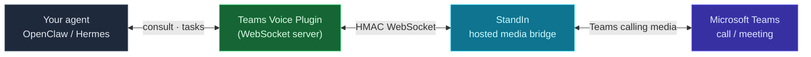
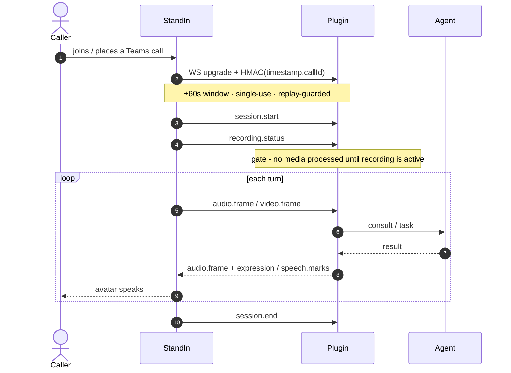

Joining a Teams call needs a media bridge that speaks Teams' real-time audio/video. **You don't run
that** - it's **StandIn**, a hosted service at [standin.komaa.com](https://standin.komaa.com). You
subscribe (free package), connect your Teams bot, and StandIn's managed bridge talks to your plugin.
The plugin is the cross-platform **brain**: it hosts a WebSocket StandIn connects to, runs the
dialogue + perception, and emits avatar driver cues. **StandIn bridges + renders; the plugin drives.**

The **plugin is the WebSocket server** (default port `:9442` on OpenClaw, `:8443` on Hermes); the
**hosted StandIn bridge is the client** that connects to it. You register your plugin's WebSocket URL
and shared secret in your StandIn dashboard - expose it so the hosted bridge can reach it (a public
URL, or a tunnel such as Tailscale).

## Call flow

A single call: the HMAC handshake, the recording-status gate, then the per-turn dialogue loop.

## Who does what

| Component | Role |
|---|---|
| **Your agent** (OpenClaw / Hermes) | the dialogue brain - answers consults, runs background tasks, produces vision/image results |
| **Teams Voice Plugin** (WS server) | hosts the bridge · realtime / streaming dialogue · vision ring + budget · emits `expression` / `speech.marks` / `display.image` cues |
| **StandIn** (hosted, standin.komaa.com) | fully-managed media bridge - joins the Teams call, renders the avatar tile, samples inbound A/V, forwards DTMF, enforces the recording-status gate, places outbound calls. No infrastructure for you to run. |
| **Microsoft Teams** | the live call / meeting and its media plane |

<Note>
  Subscribe to **StandIn** at [standin.komaa.com](https://standin.komaa.com) (free package) and connect
  your agent. There is no media server, VM, or worker for you to host.
</Note>

## Wire contract

The plugin and StandIn speak a fixed contract over the HMAC WebSocket - the same one both the OpenClaw
and Hermes plugins implement:

| Aspect | Value |
|---|---|
| **Handshake** | `HMAC-SHA256(sharedSecret, "{timestampMs}.{callId}")`, lowercase hex, sent as `X-OpenClawTeamsBridge-Timestamp` / `-Signature` headers on the WS upgrade. ±60 s window; each `(callId, ts, sig)` is single-use (replay-guarded). |
| **Path** | `/voice/msteams/stream/{callId}` |
| **Audio** | PCM 16 kHz, 16-bit, mono, little-endian; 20 ms / 640-byte frames, base64 |
| **Inbound msgs** | `session.start` · `session.end` · `recording.status` · `audio.frame` · `video.frame` · `participants` · `dtmf` · `ping` |
| **Outbound msgs** | `audio.frame` · `expression` · `speech.marks` · `display.image` · `assistant.cancel` · `pong` |

<Warning>
  The plugin's `sharedSecret` **must byte-match** the value registered for your bot in StandIn, or the
  HMAC handshake fails and no call connects.
</Warning>

## Microsoft Graph permissions

You bring your own Teams bot (BYO): register an **Azure AD app + Azure Bot resource** in your tenant,
admin-consent the **application** permissions below, and point its calling webhook at StandIn (the URL
is shown in your StandIn dashboard). These apply to both the OpenClaw and Hermes plugins.

| Permission | Enables |
|---|---|
| `Calls.JoinGroupCall.All` | answer / join Teams calls and meetings |
| `Calls.AccessMedia.All` | access real-time Teams call audio/video media |
| `Chat.Read.All` | resolve chat / thread ids and read message context |
| `ChatMessage.Read.Chat` | read messages in chats the bot is installed in |
| `Sites.ReadWrite.All` | upload files / minutes to SharePoint (OneDrive) for chat attachments |
| `Calls.InitiateGroupCall.All` | outbound "call me back" (skip if unused) |
