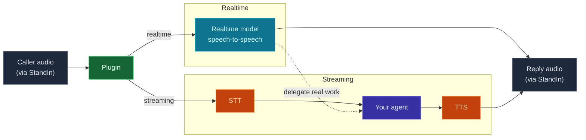

The plugin runs in one of two dialogue modes. They use the same media bridge and the same features;
they differ only in how speech becomes a reply.

<CardGroup cols={2}>
  <Card title="Realtime" icon="bolt">
    **Speech-to-speech** via a realtime model (OpenAI / Azure OpenAI). Lowest latency, natural barge-in,
    most expressive. Needs a realtime provider key.
  </Card>
  <Card title="Streaming" icon="layer-group">
    **STT → your agent → TTS.** Uses your host's existing speech stack and full agent toolchain.
    Needs `ffmpeg` on `PATH`. No realtime key required.
  </Card>
</CardGroup>

## How each mode flows

Both modes share the same inbound/outbound media path through StandIn; they differ only in the middle -
how speech becomes a reply.



## Choosing

| If you want… | Use |
|---|---|
| The lowest latency and most natural turn-taking | **Realtime** |
| Speech-to-speech expressivity (tone, emotion) | **Realtime** |
| To reuse your agent's full tool/RAG pipeline per turn | **Streaming** |
| To avoid a realtime provider subscription | **Streaming** |
| Tight control over the STT and TTS vendors | **Streaming** |

Both modes support **barge-in** (the caller can interrupt), the **vision ring**, **group-call gating**,
**DTMF**, **bilingual EN/AR**, and the avatar **driver cues**.

## Switching

<Tabs>
  <Tab title="OpenClaw">
    Set `mode` in the plugin config:
    ```jsonc
    { "mode": "realtime" }   // or "streaming"
    ```
  </Tab>
  <Tab title="Hermes">
    Pick the handler at launch:
    ```bash
    hermes teams-voice serve --handler realtime   # or: streaming
    ```
  </Tab>
</Tabs>

<Note>
  **Streaming** shells out to **`ffmpeg`** for resampling - make sure it's installed and on `PATH`.
</Note>
